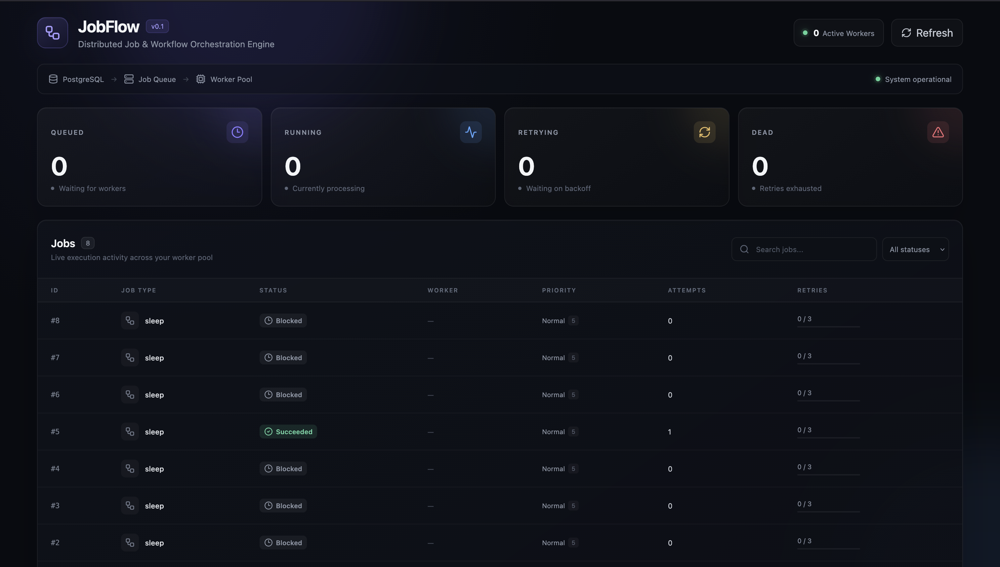

# Job Queue & Workflow Orchestration Engine
A deployed job queue system where you can submit individual jobs or multi-step DAG workflows via API, watch them
get claimed and processed by a worker pool in real time on a dashboard, and demonstrate correct failure handling like kill a
worker mid-job and watch the job automatically get requeued and completed by another worker, with retry/backoff
visibly working in the UI.
## Design
<p>
  
 
</p>

## System Architecture

```text
                            JOBFLOW
                 Distributed Job Orchestration

                              │
                 ┌────────────┴────────────┐
                 │                         │
              REST API                 Dashboard
                 │
                 ▼
         ┌─────────────────┐
         │   PostgreSQL    │
         │                 │
         │ jobs            │
         │ workflows       │
         │ dependencies    │
         └────────┬────────┘
                  │
       ┌──────────┼───────────────┐
       │          │               │
       ▼          ▼               ▼
   Scheduler   Worker Pool   Heartbeat Monitor
       │          │               │
       │          │               │
   due jobs     claim jobs      detect crashes
       │          │               │
       ▼          ▼               ▼
     QUEUED    RUNNING          REQUEUE
                  │
          ┌───────┴────────┐
          │                │
          ▼                ▼
       SUCCESS           FAILURE
          │                │
          │                ▼
          │          Exponential Backoff
          │                │
          │          ┌─────┴─────┐
          │          ▼           ▼
          │        RETRY        DEAD
          │
          ▼
   Unlock DAG Dependencies
```
## Tech Stack

| Component | Technology |
|---|---|
| Language | Python |
| Backend | FastAPI |
| Async Runtime | asyncio |
| Database | PostgreSQL |
| ORM | SQLAlchemy |
| PostgreSQL Driver | asyncpg |
| Job Claiming | `FOR UPDATE SKIP LOCKED` |
| Scheduling | Dedicated scheduler process |
| Reliability | Retries + Heartbeats + Dead Letter |
| Workflow Engine | DAG dependency resolution |
| Frontend | React + Vite |
| HTTP Client | Axios |
| Containerization | Docker 

## Why JobFlow?

Most backend portfolio projects stop at CRUD APIs.

JobFlow focuses on a different problem:

> **What happens when distributed work fails?**

It explores how a system continues processing work when jobs fail, workers crash, multiple workers compete for jobs, scheduled work becomes due, and workflow steps depend on each other.

---
